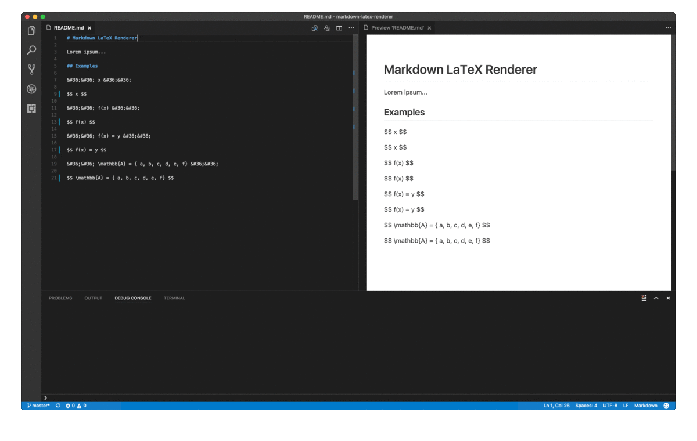

# Markdown LaTeX Renderer

Markdown LaTeX Renderer is a VSCode Extension to convert Markdown files' LaTeX expressions into SVG images on-the-fly.



## Settings

Create a `markdownLaTeXRenderer.json` file in your `.vscode` folder as follows:

```json
{
    "imagesFolderName": "images",
    "imagesUrlPreffix": "https://rawgit.com/agurz/Markdown-LaTeX-Renderer/master/example/"
}
```

* **imagesFolderName**: Folder where SVG images will be stored. This folder is relative to .md document
* **imagesUrlPreffix**: String to prepend to image path (The image path is relative to .md document
